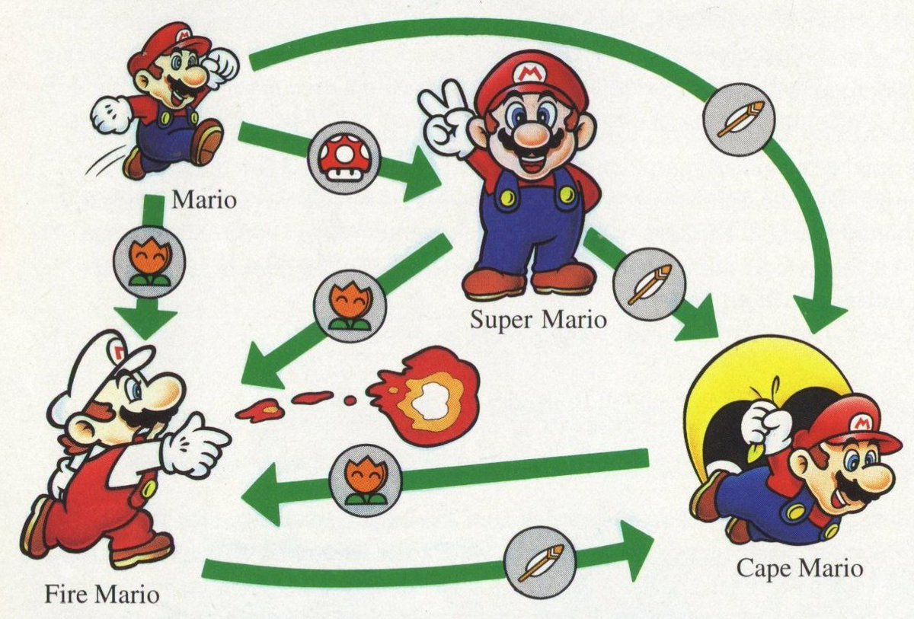

Introduction
---

# Création d'une banque en ligne

## fonctionnalité

- Créer un compte bancaire
- pouvoir faire des dépots et des retraits
- avoir des comptes bancaires avec ou sans découvert
- exposer avec une API REST
- indépendance de la base de données

## Contrainte technique

- empreinte écologique faible
- sûre en terme de mémoire
- performant
- langage simple et expressif

<!-- end_slide -->

Choix du langage - performance
---

# Etudes des performances de différents langages

| Name | Energy| Temps | Mémoire |
| ------ | ------ | ----- | ------ |
| C | 1.0 | 1.0 | 1.24 |
| Javascript | 4.45 | 6.52 | 4.59 |
| Java | 1.98 | 1.89 | 6.01 |
| Python | 75.88 | 71.90 | 2.80 |
| Rust | 1.03 | 1.04 | 1.54 |

**lien vers l'étude** [](https://repositorio.inesctec.pt/server/api/core/bitstreams/d606d7dd-be10-4bc7-ada6-5c0c91fe1afb/content)

<!-- end_slide -->

Choix du langage - coût
---

# Estimation des couts sur aws lambda

Nombre de requête : 20 000 000.


| Name | Coût |
| ------ | ------ |
| Javascript | 8 736 $ |
| Scala | 20 000 $ |
| Python | 2 506.56 $ |
| Rust | 672 $ |

**lien vers l'étude** [](https://xebia.com/blog/aws-lambda-benchmarking/)

<!-- end_slide -->
Choix du langage - technique
---

# Autres facteurs

## Gestion de la mémoire

- Gestion manuelle de la mémoire (C, C++)
- Tracing garbage collector (Java, node, ...)
- Reference Counting (Swift)

Le compilateur de rust est responsable d'ajouter les instructions nécéssaire pour libérer la mémoire.

## Autres features
* Typage fort
* Utiliser par des acteurs de l'industrie
  * linux
  * amazon
  * microsoft
  * discord
* Large écosystème

<!-- end_slide -->

Présentation rapide de l'écosystème
---

# Outil de build

- rustup
- cargo
- clippy
- fmt

# Librairies

- https://crates.io/
- https://blessed.rs/crates

# IDE
- helix
- vscode
- rustrover (jetbrains)
- ...

<!-- end_slide -->
<!-- jump_to_middle -->
Découvrons rust ensemble
---

<!-- end_slide -->
Récapitulatif : Gestion de la mémoire
---

# Concept clefs

## Ownership

- Chaque variable rust a **un et un seul** propriétaire.
- Une fois que la valeur a été transféré (move), elle ne peut plus être utilisée.

## Borrowing

- Les **références** permettent d'emprunter une valeur sans transférer la propriété.
- Il est possible de prêter **plusieurs fois** une variable en lecture.
- Il est possible de prêter **qu'une fois** une variable en écriture.
<!-- end_slide -->

Récapitulatif (concept simple de rust)
---
``` rust
fn main() {
    // Assignation de variable
    let x = 5;
    println!("The value of x is: {}", x);

    // Utilisation de mut pour rendre la variable mutable
    let mut y = 10;
    println!("The initial value of y is: {}", y);
    y = 20;
    println!("The new value of y is: {}", y);

    // Utilisation de tuples
    let tuple = (1, 2.5, "hello");
    let (a, b, c) = tuple;
    println!("The values in the tuple are: {}, {}, and {}", a, b, c);

    // Appel d'une fonction pour afficher une chaîne de caractères
    display("Hello, Rust!");
}

// Définition d'une fonction simple pour afficher une chaîne de caractères
fn display(message: &str) {
    println!("Message: {}", message);
}
```
<!-- end_slide -->
<!-- jump_to_middle -->

Implémentons la première feature
---

<!-- end_slide -->
Récapitulatif (struct)
---

# Un simple struct

```rust {1-4|6-22|all} +line_numbers
struct Person {
    name: String,
    age: u32,
    email: String,
}

impl Person {
    fn new(name: String, age: u32, email: String) -> Person {

        Person { name, age, email }
    }
    
    fn get_name(&self) -> &str {
        &self.name
    }

    fn set_email(&mut self, new_email: String) {
        self.email = new_email;
    }

}

```

<!-- end_slide -->

Récapitulatif (enum)
---

# Un simple enum

```rust {1-4|6-16|all} +line_numbers
enum Figure {
    Circle { radius: f64 },
    Square { side: f64 },
    Rectangle { width: f64, height: f64 },
}

impl Figure {
    fn perimeter(&self) -> f64 {
        match self {
            Figure::Circle { radius } => 2.0 * std::f64::consts::PI * radius,
            Figure::Square { side } => 4.0 * side,
            Figure::Rectangle { width, height } => 2.0 * (width + height),
        }
    }
}
```

<!-- end_slide -->

Les types de données algébriques
---


**source** https://www.ashishvishwakarma.com/GoF-Design-Patterns-by-Example/State-Pattern/

<!-- end_slide -->

Les types de données algébriques
---

<!-- column_layout: [1, 3] -->

<!-- column: 0 -->
```rust
#[derive(Clone, PartialEq)]
enum Character {
    Mario,
    SuperMario,
    FireMario,
    CapeMario,
}
```

``` rust 
enum Food {
    MushRoom,
    Fire,
    Feather,
}

```

<!-- column: 1 -->
``` rust
impl Character {

    fn eat(&self, food: Food) -> Character {
        match (self, food) {
            (Mario, MushRoom) => SuperMario,
            (Mario | SuperMario | FireMario | CapeMario, Fire) => FireMario,
            (Mario | SuperMario | FireMario | CapeMario, Feather) => CapeMario,
            (_, MushRoom) => self.clone(),
        }
    }
    
}
```

<!-- end_slide -->

Le polymorphisme en rust
---

# Les traits
``` rust
// Définition de la structure
struct Circle {
    radius: f64,
}

// Définition d'un trait nommé `Shape` avec une méthode `area`
trait Shape {
    fn area(&self) -> f64;
}

// Implémentation du trait `Shape` pour la structure `Circle`
impl Shape for Circle {
    fn area(&self) -> f64 {
        std::f64::consts::PI * self.radius * self.radius
    }
}
```
<!-- end_slide -->
Le polymorphisme en rust
---

# Les générics

``` rust

```
<!-- end_slide -->

